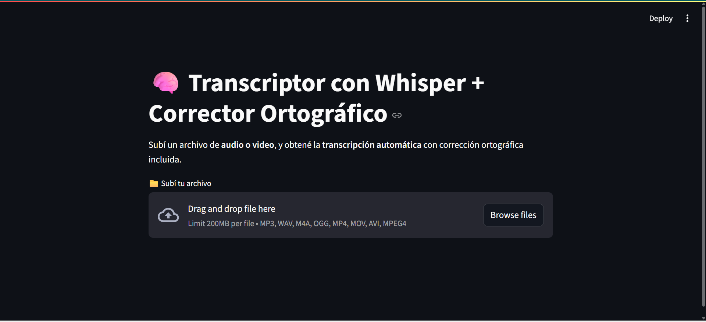

### 🧠 Transcriptor de Video con Whisper

Esta app permite transcribir automáticamente el contenido de archivos de audio o video, usando inteligencia artificial (OpenAI Whisper) y PyTorch. También corrige automáticamente la ortografía del texto resultante.

## 🚀 Funcionalidades

- Soporte para archivos `.mp3`, `.mp4`, `.wav`, `.mov`, `.avi`, etc.
- Transcripción automática usando Whisper
- Corrección ortográfica usando LanguageTool
- Descarga del texto generado
- Interfaz simple con Streamlit

## 🛠️ Requisitos

- Python 3.10+
- ffmpeg instalado
- Java (para LanguageTool)
- GPU (opcional, recomendado)

## 📦 Instalación

1. Clonar el repositorio:
<pre>
```bash
git clone https://github.com/Rodrivazq/WhisperTranscriptor.git
cd WhisperTranscriptor
</pre>

2. Crear entorno virtual:

python -m venv .venv
.venv\Scripts\Activate.ps1  # En Windows, terminal powershell

3. Instalar dependencias:

pip install -r requirements.txt

4. Ejecutar la app:

streamlit run app.py

## 📸 Capturas de pantalla

### Pantalla principal



## ✨ Créditos
Desarrollado por Rodrigo Vázquez como proyecto final de la diplomatura en programación con IA.
